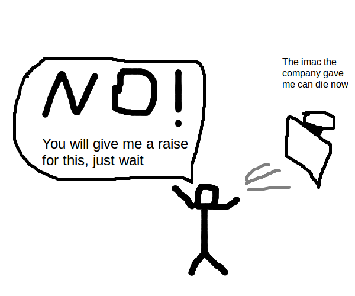
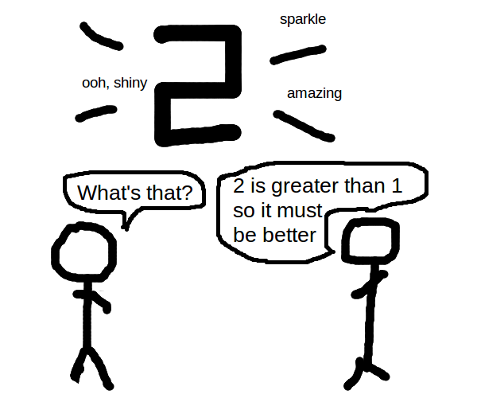
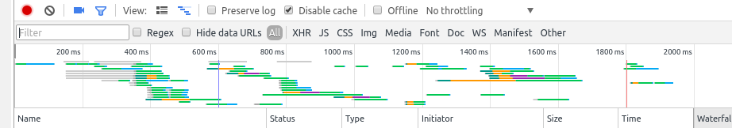
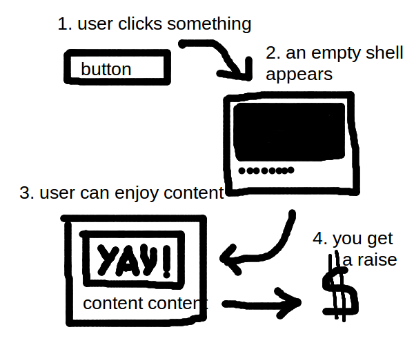
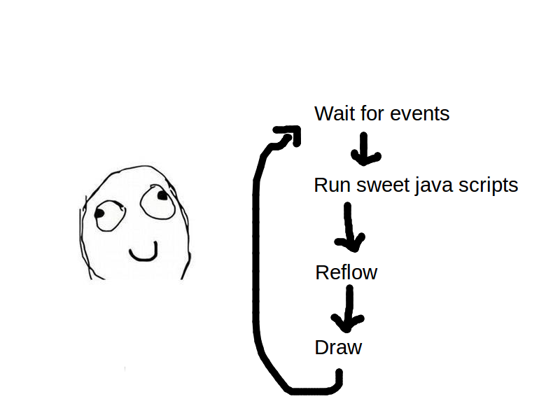

# Why is perf important

 - Performance is linked to money
 - If your site is faster your employer gets more money
 - And then you obviously get a raise

-slide-

# What am I going to talk about

 - Network - how fast does the page load
 - Perceived performance
 - CPU - does your page crash the browser

-slide-

# Test test test

 - Do not try this at home!
 - Until you test and prove that you have a problem
 - A lot of performance optimisations mean slower build times and can hurt debugging

-slide-

# No seriously

 - Buy an actual lab coat and actually wear it

*(credit: xkcd)*

-slide-

# Your mileage may vary

You have been warned

-slide-

# Network

-slide-

# Tools to check you're using the tubes good

-slide-

# Timeliner

 - https://www.npmjs.com/timeliner
 - Super duper easy
 - Install it in your CI, keep a history of this output

        fabio@thinkpadlel ♥  timeliner https://www.sapo.pt
        ┌──────────────────┬──────────────────┬───────┬───────┐
        │ metric           │ mean             │ min   │ max   │
        ├──────────────────┼──────────────────┼───────┼───────┤
        │ render           │ 0.562 (+/-0.018) │ 0.543 │ 0.596 │
        ├──────────────────┼──────────────────┼───────┼───────┤
        │ domcontentloaded │ 0.745 (+/-0.020) │ 0.720 │ 0.775 │
        ├──────────────────┼──────────────────┼───────┼───────┤
        │ load             │ 2.246 (+/-0.243) │ 1.831 │ 2.480 │
        └──────────────────┴──────────────────┴───────┴───────┘

-slide-

# YSlow

 - http://yslow.org/
 - Old school browser plugin from yahoo
 - Loads your page and checks a bunch of things you may be doing wrong

-slide-

# Google pagespeed insights

 - https://developers.google.com/speed/pagespeed/
 - Loads your page
 - Checks a bunch of stuff, and gives you a score. Try to beat your competitor's web sites! >:D

-slide-

# Chrome debugger

 - Nice visualisation of what HTTP requests you're doing and when
 - Screenshots so you know what's going on as you load several items on the page
 - Take care -- don't optimise for chrome only

-slide-

# Make good use of the tubes

 - You usually have 6 connections
 - The browser stop looking when it encounters a <script> tag without the async attribute
 - HTTP round trips are expensive
 - DNS resolution is expensive

-slide-

# Minimize requests

Just say no

 - And I don't mean don't do drugs

-slide-

# Minimize requests

-slide-

# Minimize requests

 - The first thing you need to consider when you want to make a better use of the tubes

-slide-

# Caching

 - Not all page loads will be the first load *(no shit sherlock)*
 - Make sure you use cache headers
 - Version your scripts and styles! That way you can make them expire far in the future

-slide-

# Caching

 - Or don't version them. Use a hash.

        <link rel=stylesheet href=/style?hash={{sha1}}>

-slide-

# Minimize round trips

 - HTTP requests for CSS files, iframes and <script> tags can trigger more HTTP requests!
 - But the browser only knows what to fetch when they have been fetched themselves

-slide-

# Minimize round trips

 - Inline on the <head> some parts of your CSS which include files. Font definitions, background image URLs
 - Inline the tiniest of images as base64 data:urls
 - Consider inlining SVG documents instead of downloading an icon font
 - Are you using Tealium? Try to move critical stuff to an actual <script> tag
 - Are you using HTTPS? Use HSTS for added security and added perf!

-slide-

# Use HTTP/2!

-slide-

# Use HTTP/2!

 - I don't know much about this. Go learn for yourself 💖
 - You won't worry so much about minimizing requests, but round trips will still be a problematic

-slide-

# GZIP

 - "I ate spam with spam and spam"
 - "(#1 means spam)I ate #1 with #1 and #1"

-slide-

# GZIP

 - Make sure you compress your stuff using gzip!
 - Remembers substrings you used before in text, repeats them
 - Repetitive code becomes smaller
 - Turn it off for images, fonts

-slide-

# Minify your ugly code!

 - cssmin, uglifyjs, html minifiers (or just using react)
 - May not be worth it if the files are too small. Save your developer time!
 - For CSS, try to get rid of CSS prefixes. It's not funny anymore guys.

-slide-

# Start loading stuff as soon as possible

-slide-

# Start loading stuff as soon as possible

-slide-

# Putting stuff in the `<head>`

You can use this to

 - minimize requests
 - start loading stuff earlier
 - minimize round trips

-slide-

# Putting stuff in the `<head>`

 - Don't forget that the first 1 or 2 images will occupy a place in the pipeline
 - Is your CSS small? Put it all there!
 - You may have been told to put all script tags in the footer, but these days you have the `async` attribute

-slide-

# Don't block the render

 - The page won't render until the browser has fetched the stylesheet and all fonts you use
 - Inline that stuff if you have to -- or use critical CSS
 - DO NOT put any synchronous tags (<script> without async) there, if you have any sync script tags consider inlining them

-slide-

# Perceived performance

-slide-

# Perceived performance

 - If your user thinks you're fast, you don't have to be fast

-slide-

# How to improve perceived performance?

 - Show *something* as soon as you can
 - It's okay to show your page before the fonts load. The user's chicken brain can get used to the layout
 - If you have a UI change triggered by an interaction, try to get the basic colors and shapes on screen in under 100ms

-slide-

# CPU

-slide-

# CPU

 - Computers have CPUs
 - Mobile phones have super weak CPUs
 - Don't crash firefox on my quad core please

-slide-

# Chrome and firefox debuggers

 - Find out if you're allocating objects in tight loops
 - Find out when reflows happen

-slide-

# jsPerf

 - https://jsperf.com/
 - Create small test cases and test them across browsers
 - Don't micro-benchmark! Try to use it for DOM stuff only

-slide-

# CSS triggers

 - https://csstriggers.com/
 - Lists what CSS properties will cause a reflow

-slide-

# How to use less CPU

 - Do less stuff!

-slide-

# Avoid unnecessary abstractions

-slide-

# Avoid unnecessary abstractions

 - Using React may be good for working on a complex page, but is its overhead welcome in a tiny iframe-based app?
 - Do you need to download React just for a dropdown menu, or can you just render the HTML on the server?
 - Do you really need a templating engine or can you just update DOM elements one by one?

-slide-

# The DOM isn't as slow as you think

 - https://github.com/patrick-steele-idem/morphdom#benchmarks

-slide-

# What's really really slow

-slide-

# And I mean slow

-slide-

# Are reflows

-slide-

# What's a reflow?

 - A reflow is what occurs when the browser has to recalculate the page's layout. That is, what elements go where, and what their sizes are, and how the lines of text flow.

-slide-

# Why are reflows bad?

 - Reflows are slow. If you have too many reflows, your site won't be fast, and you won't get a raise!
 - When a reflow happens, a kitten dies somewhere, and Donald trump signs an executive order

-slide-

# The browser's loop

-slide-

# Avoiding reflows

 - Never animate anything at all. Convince your employer that it's ugly and useless

-slide-

# Avoiding reflows

 - Check out this comprehensive gist by Paul Irish
 - https://gist.github.com/paulirish/5d52fb081b3570c81e3a

-slide-

# Avoiding reflows

 - Learn about layout boundaries
 - http://wilsonpage.co.uk/introducing-layout-boundaries/

-slide-

# Avoiding reflows

 - When you hide the scrollbar for some reason, change the width of the container

-slide-

# Avoiding reflows

 - Mitigate your reflows by having a smaller DOM

-slide-

# Avoiding reflows

 - Go to csstriggers.com before you do any kind of animation or interaction that changes the DOM
 - Change classnames deep in the DOM tree. (haven't tried it myself)

-slide-

# Avoiding reflows

 - Batch your reads and writes. First change everything, then measure everything

          element1.style.width = '50%';
          element2.style.width = '50%';
          doSomething(element1.offsetWidth);  // reflow!
          element3.style.width = '50%';
          doSomething(element3.offsetWidth);  // reflow!

-slide-

# Conclusion

 - We've looked at network, perceived performance and CPU
 - There's lots more so get learning
 - Don't believe what you think, or what an entire community likes to believe. Check for yourself

